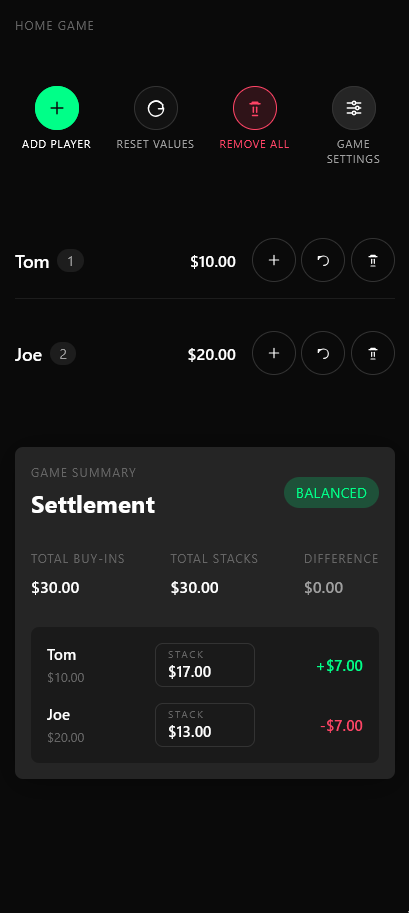

#  Home Game

 `home-game` is a small React + Vite app for tracking a home poker game.

It helps you:

- add players at the table
- log buy-ins for each player
- record final stacks at the end of the game
- see who is up or down in the settlement view
- reset values or remove players when the table changes

## Live Demo

- [Open the app on GitHub Pages](https://mattaschmann.github.io/home-game/)

## How it works

- Player data is saved in the browser so your table state persists between refreshes.
- You can add a player from scratch or reuse names from past games.
- Buy-ins and final stacks use dollar amounts and the app calculates totals automatically.
- The settlement section compares total buy-ins against total stacks to show whether the game is balanced.

## Tech stack

- React 19
- Vite
- `gh-pages` for deployment

## Scripts

- `npm run dev` - start the local dev server
- `npm run dev-lan` - start the dev server on your local network
- `npm run build` - create a production build
- `npm run lint` - run ESLint
- `npm run preview` - preview the production build locally
- `npm run deploy` - build and publish to GitHub Pages

## License

MIT
